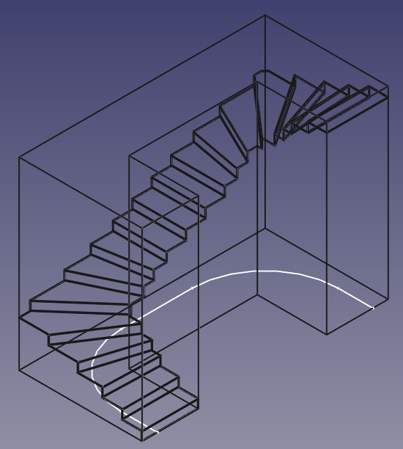

FreeCadStairConstructor
=======================

This is a set of macros that can be used to construct stairs in FreeCad (presumably for use with the architectural workbench).

Stairs are constructed from a draft line, and will be constructed to be perpendicular to that line and with equal distances
between steps on that line.

Tested with FreeCad 0.17, but should work with other versions as well.

